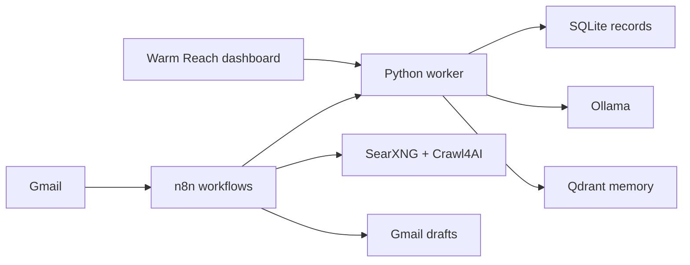
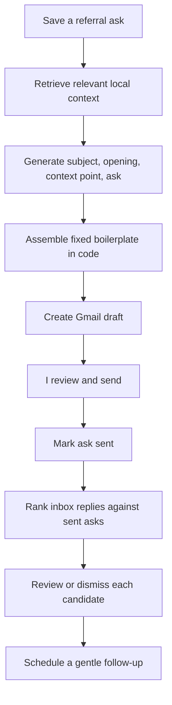

# Warm Reach

A self-hosted platform for asking people for referrals, without the outreach
sounding like it came from a machine.

Warm Reach keeps my referral contacts, the relationship context, and every ask
in one local database. It drafts the email, ranks which inbox replies probably
belong to which ask, and reminds me to follow up. It never sends anything. Every
message leaves as a Gmail draft I read and send myself.

Everything runs on my own machine through Docker. Generation is local through
Ollama, so no message content and no contact list is sent to a paid API.

## Why it works this way

Cold outreach automation is easy to build and easy to make embarrassing. Three
constraints shaped the whole design:

**The model never sends.** Every workflow terminates at a Gmail draft. Sending
stays a human action, so a bad generation costs me a deleted draft rather than a
burned relationship.

**The model writes fragments, not letters.** Ollama generates only a subject, an
opening line, an optional relationship point, and the ask itself. The greeting,
spacing, sign-off, and my name are assembled in code afterward. The parts that
have to be stable never pass through a sampler.

**Reply matching is deterministic and explainable.** Deciding whether an inbox
message answers a specific ask is scored in Python with fixed weights, and every
candidate stores the reasons it scored what it did. No model is asked to judge
it, so the result is inspectable and testable rather than a black box.

## How it fits together



n8n handles orchestration and the Gmail connection. Everything with actual logic
in it — matching, scoring, follow-up rules, CRM writes, the dashboard API — lives
in the Python worker instead of inside n8n nodes, so it can be covered by
ordinary unit tests rather than clicked through in an editor.

The worker is standard-library Python only. No pip install is needed to run the
test suite.

## The draft pipeline



An ask moves through `planned`, `draft`, `ready`, `sent`, `replied`, `referred`,
`closed`. Nothing but me moves it to `referred`.

## Reply matching

When a message arrives, it is scored against every ask currently marked `sent`:

| Signal | Points |
| --- | --- |
| Sender address matches the referral contact | 65 |
| Shared context terms with the ask (5 each) | up to 20 |
| Received after the ask was sent | 10 |
| Subject begins with `Re:` or `Reply:` | 5 |

The total is capped at 100 and bucketed into `high` at 80 or above, `medium` at
55, `low` at 25, and `unlikely` below that. A candidate is discarded entirely
unless the sender address matches or the message shares at least two context
terms with the ask, which keeps near-random overlaps out of the queue.

Each stored candidate keeps its score, its confidence band, the reasons behind
it, and the source message metadata. Candidates sit in `pending` until I mark
them `reviewed` or `dismissed`, and neither action changes the ask's status.

## Run it

```powershell
Copy-Item .env.example .env
docker compose up -d
docker compose exec ollama ollama pull qwen3:4b
docker compose exec ollama ollama pull nomic-embed-text
```

Before the first run, set two values in `.env`: replace
`N8N_ENCRYPTION_KEY` with 32 or more characters, and give `CRAWL4AI_API_TOKEN` a
long random value. Crawl4AI binds to loopback when that token is blank, which
makes it unreachable from n8n over the Docker network.

Then open n8n at `http://localhost:5678`, create the owner account, add the Gmail
and SMTP credentials, and import the workflows from `n8n/workflows`. The
[credential and first-run guide](docs/credentials.md) has the exact steps.

Open Warm Reach at `http://localhost:8087/dashboard`.

Every workflow ships inactive. Nothing polls a mailbox or creates a draft until
it is imported, given a credential, and switched on deliberately.

### Services

| Service | Port | Role |
| --- | --- | --- |
| n8n | 5678 | Workflow orchestration and Gmail |
| Worker and dashboard | 8087 | Local API, matching, dashboard |
| Ollama | 11434 | `qwen3:4b` drafting, `nomic-embed-text` embeddings |
| Qdrant | 6333 | Vector memory, 768 dimensions |
| SearXNG | 8088 | Metasearch |
| Crawl4AI | 11235 | Public-page crawling |
| Appsmith | 8089 | Optional, `dashboard` profile |
| Watchtower | — | Optional, `maintenance` profile |

## Tests

```powershell
python -m unittest
```

```text
Ran 39 tests in 0.754s

OK
```

The 39 tests cover classification normalization, recruiter ranking, follow-up
scheduling, CRM reads and writes, RAG against both the current and legacy Ollama
embedding response shapes, and validation of all eight workflow exports.

## Workflows

Eight importable exports, split by responsibility rather than bundled into one
large graph:

| Export | Purpose |
| --- | --- |
| `01-email-monitoring` | Classify inbound mail, gate on an identified company |
| `02-recruiter-research` | Search and rank recruiter profiles |
| `03-email-drafting` | Generate parts, assemble boilerplate, create a draft |
| `04-crm-updates` | Upsert records behind an explicit input contract |
| `05-reminder-engine` | Follow-up reminders |
| `06-daily-report` | Daily summary email |
| `07-referral-outreach` | Referral draft creation |
| `08-referral-reply-monitor` | Poll unread mail, call the local matching API |

Exports 01 to 06 are the earlier job-application workflows, kept working. 07 and
08 are the referral core.

Each n8n import generates its own workflow IDs, so a parent workflow's
sub-workflow references break on import. `n8n/workflows/*.mjs` and
`scripts/repair_n8n_subworkflow_links.ps1` rebind them against a live instance
while preserving the existing IDs.

## Layout

```text
scripts/recruiting_ai/   worker, matching, CRM, dashboard
n8n/workflows/           workflow exports and repair helpers
database/schema.sql      15 SQLite tables
prompts/                 versioned prompt templates
docs/                    setup, credentials, architecture, workflows
tests/                   unit tests
```

## Docs

[Setup](docs/setup.md) · [Credentials](docs/credentials.md) ·
[Environment](docs/environment.md) · [Architecture](docs/architecture.md) ·
[Workflows](docs/workflows.md) · [Workflow diagram](docs/workflow_diagram.md) ·
[Dashboard](docs/dashboard.md) · [Referral workflow](docs/referral-workflow.md) ·
[Reply monitoring](docs/reply-monitoring.md) · [Models](docs/models.md) ·
[Prompts](docs/prompts.md) · [Source policy](docs/source_policy.md)

## Defaults I kept

- Email is drafted, never sent automatically.
- Credentials live in `.env` or the n8n credential store, never in the repo.
- Crawling is limited to public pages and authorized sources.
- Duplicate processing is prevented by stable event keys and unique constraints,
  so a re-run does not create a second record.
- Swapping models is an environment variable, not a code change.
