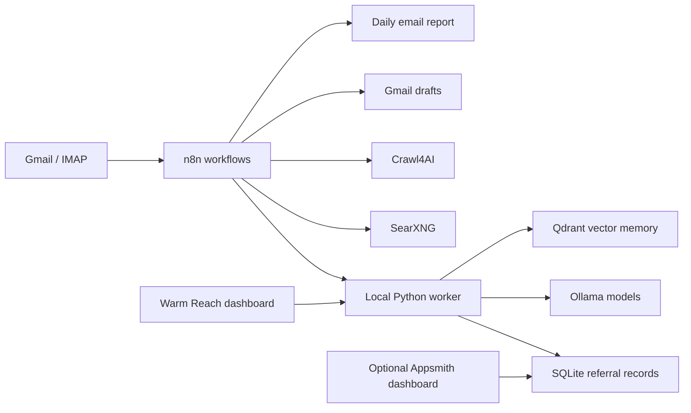

# Architecture

The existing n8n workflows are split by responsibility:

- Email monitoring
- Recruiter research
- Email drafting
- Referral reply monitoring
- CRM updates
- Reminder engine
- Daily reports

The worker keeps custom logic outside n8n so referral writes, follow-up rules, and the built-in dashboard API can be tested with regular unit tests. The dashboard reads local SQLite through the worker; it does not expose the database directly to the browser.
