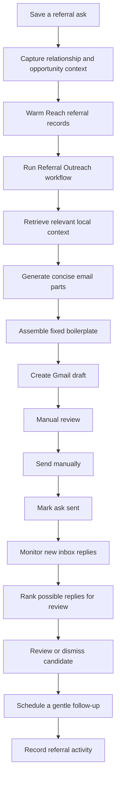

# Workflow Diagram

```mermaid
flowchart TD
    A["Save a referral ask"] --> B["Capture relationship and opportunity context"]
    B --> C["Warm Reach referral records"]
    C --> D["Run Referral Outreach workflow"]
    D --> E["Retrieve relevant local context"]
    E --> F["Generate concise email parts"]
    F --> G["Assemble fixed boilerplate"]
    G --> H["Create Gmail draft"]
    H --> I["Manual review"]
    I --> J["Send manually"]
    J --> K["Mark ask sent"]
    K --> L["Monitor new inbox replies"]
    L --> M["Rank possible replies for review"]
    M --> N["Review or dismiss candidate"]
    N --> O["Schedule a gentle follow-up"]
    O --> P["Record referral activity"]
```

The current exports retain the legacy job-email workflows and add dedicated referral-outreach plus reply-monitoring workflows. All email creation remains draft-first.
